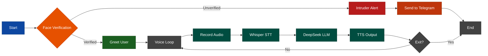

# **Big_Brother**  
### *Multi‑Modal AI Assistant with Visual Authentication*

Big_Brother is a personal pet project initially begin as final project for LLM course at IASBS. The aim is to design a  secure, context‑aware AI system that does the following in order:
- Watches the environment and if identifies you, greets you and waits for your response.
- Otherwise if set for gaurding, it would take a pic from the introders and sends them to the user via Telegram.
- If visually authenticated, listens to you for a brief time, then respounds to you verbally and this loop goes on as long as you say the interrupt words.
- If set for gaurding, it would take a pic from the introders and sends them to the user via Telegram.

>fuses **facial recognition**, **speech understanding**, and **LLMs** – to communicate, while keeping a watchful eye on its surroundings.

---

## Project Flow

## Component Breakdown

### 1. Face Verification  
- **Goal** – Unlock the assistant only for authorised users.  
- **Design** – Uses `insightface` with the **buffalo_l** model for accurate face detection and embedding extraction. Compares live webcam feed against a stored reference image.  
- **Outcome**  
  - **Match** → grants access (green path).  
  - **Mismatch** → captures the intruder’s face, logs the event, and sends an instant alert via Telegram (red path).  
  

### 2. Speech Pipeline (STT + TTS)  
- **Goal** – Transcribe user speech and synthesize responses.  
- **STT** – Records audio via `PyAudio`, then processes it with **Whisper** (local, high‑accuracy ASR) – supporting Persian and other languages.  
- **TTS** – Uses `pyttsx3` for offline, low‑latency voice output – no internet dependency.  
  

### 3. LLM Integration (DeepSeek via OpenRouter)  
- **Goal** – Deliver intelligent, context‑aware replies.  
- Sends transcribed text to the **DeepSeek** model through OpenRouter’s API.  
- Receives a natural‑language response, which is then passed to the TTS engine.  
> *No local GPU required for the LLM – all reasoning happens in the cloud, keeping the local footprint light and limited for vision component.*
  

### 4. Alert System (Telegram Bot)  
- **Goal** – Notify you when an unauthorised person appears.  
- On detection, the system captures a photo and sends it as a document to your Telegram chat.  
- Uses the **Bot API** with `requests` – immediate, reliable, and mobile‑friendly.

> Testing the bot ...

---

### Getting Started

The system is orchestrated via `main()` – simply run it, and it will:

1. Verify your face.
2. Greet you (or scold intruders).
3. Enter a conversation loop until you say interrupt words such as *“shutdown”* or *“exit”*.

> *Hint: The assistant is fully conversational – you can ask it anything, from weather to philosophy, as long as DeepSeek has an answer. Also some functionalities are hard coded and certainly would benefit from more dynamically adjusted mechanism (e.g. interrupt mechanism), which will be adjusted eventually in the future*

---

**Created by:** M Hossein Hashemi  
**Intial Codding Date: Dec 2025** 
_Under Developement_

---
